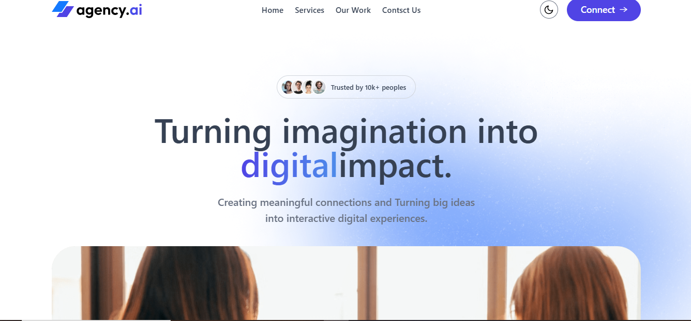

# 🌐 Mon Site Web - ReactJS

Bienvenue sur le dépôt de mon site web personnel/professionnel développé avec **ReactJS**.  
Ce projet présente [👉 décris brièvement ton site : portfolio, blog, application, etc.].

---

## 🚀 Technologies utilisées
- ⚛️ [ReactJS](https://react.dev/) - Bibliothèque JavaScript pour l'UI
- 🎨 [Tailwind CSS ] - Styles et design responsive
- 📦 [Vite / Create React App] - Outil de build et dev server rapide
- 🌙 [react-hot-toast / framer-motion / autres libs] *(si tu en as utilisé)*

---

## 📦 Installation & Lancement

### 1️⃣ Cloner le projet
```bash
git clone https://github.com/mon-compte/mon-projet.git
cd mon-projet

2️⃣ Installer les dépendances

npm install
# ou
yarn install

3️⃣ Lancer le serveur de développement
npm run dev
# ou
yarn dev


Le projet sera accessible sur http://localhost:5173
 (Vite) ou http://localhost:3000


📂 Structure du projet

/mon-projet
 ├── /src
 │   ├── /components   # Composants réutilisables
 │   ├── App.jsx       # Point d’entrée de l’application
 │   └── main.jsx      # Bootstrap de React avec Vite
 ├── package.json
 └── README.md


🌟 Fonctionnalités

✅ Design responsive

✅ Navigation fluide avec React Router

✅ Intégration d’animations et d’icônes

✅ Formulaire de contact avec API Web3Forms

📸 Aperçu




👨‍💻 Auteur

Développé avec ❤️ par Ulrich LeBlack

Portfolio: https://ulrichleblack.vercel.app/

LinkedIn: https://www.linkedin.com/in/ulrich-leblack-7a803220a/

